# EDMC-MarketScout

## What Is MarketScout

EDMC-MarketScout is a plugin for Elite Dangerous Market Connector (EDMC) built for commanders who enjoy the trading play-style in Elite Dangerous.

It helps find jackpot trade opportunities, such as Palladium, Gold, and Silver around 6k credits, plus other strong market opportunities like low-price Agronomic Treatment. It also includes commodity reference tools, rare commodity information, engineer unlock data, a trade ledger, and local station scouting views.

MarketScout is especially helpful for commanders who trade with a Fleet Carrier. It includes carrier-focused tools such as Carrier Trade Announcements, which can generate trade text for Reddit or Discord and, importantly, an amazingly fast way to generate a poster image to go with the announcement.

MarketScout uses a local web interface, making it comfortable to run on a second screen, tablet, or small laptop while Elite Dangerous is open.

MarketScout is not affiliated with Elite Dangerous Market Connector, EDCD, or Frontier Developments.

## Installation

1. Download the [latest release](../../releases/latest).
2. Extract the downloaded zip.
3. Copy the single `EDMC-MarketScout` folder from the zip into your EDMC plugins folder.
4. To find the EDMC plugins folder, open EDMC, then go to `File` -> `Settings` -> `Plugins` and click `Open Plugins Directory`.
5. Restart EDMC.
6. Click the newly added `MarketScout` button in EDMC. Your browser will open MarketScout, and it can now assist with your Elite Dangerous trades.

If you are cloning the repository for development instead of installing a release zip, the installable plugin is the inner `EDMC-MarketScout/` directory. The repository also contains maintainer tools, project notes, and other development files that should not be copied into EDMC's plugins directory.

## One-Click Updates

MarketScout checks GitHub releases on startup. When a newer release is available, the Web UI shows a prominent update button in the top status bar.

Clicking the button downloads the release zip, creates a backup of the currently installed plugin, applies the new files, and then asks you to restart EDMC. If the automatic update cannot complete, MarketScout shows the backup location so you can restore the previous version manually.

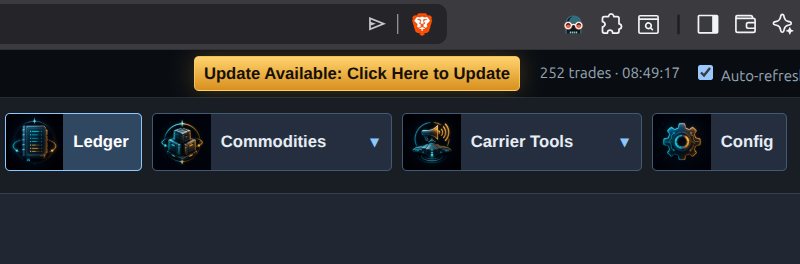

## Usage

### Stations

Shows station market data collected while EDMC and MarketScout were running. Use it to filter visited stations, review watched commodities, and find the current Best Buy opportunity for each station.

#### Watched Commodities

Watched Commodities control which commodity-specific columns are shown in the Stations table. For the best experience, using up to 3 watched commodities is recommended, but you can add more depending on your screen size or if you do not mind horizontal scrolling. The table gets wider as more commodities are added.

#### Best Buy Ignore List

The Best Buy ignore list excludes selected commodities from Best Buy calculations. This is useful for commodities that may look good mathematically but are not practical for your trading style, such as commodities that are difficult to sell near their galactic maximum.

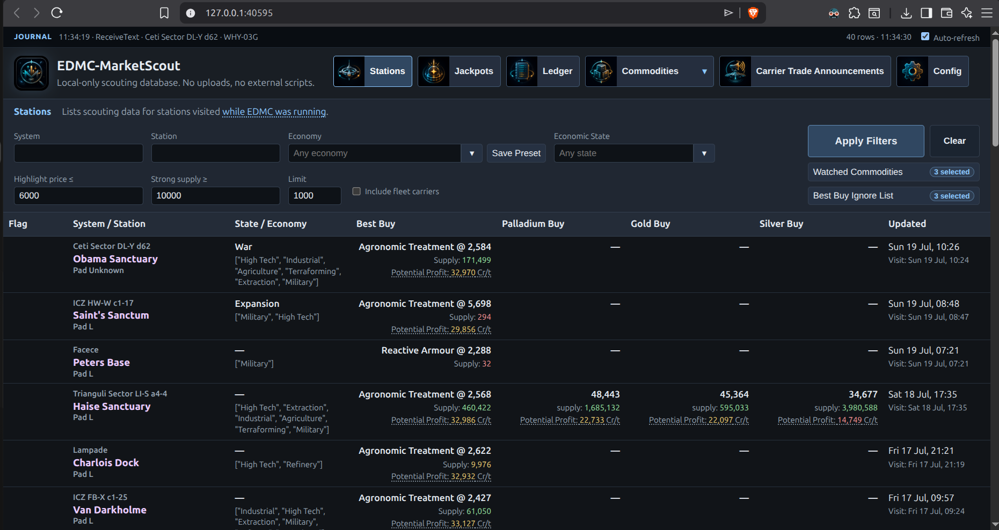

### Jackpots

Tracks high-value jackpot opportunities over time, including samples that help show whether a deal is still healthy or fading.

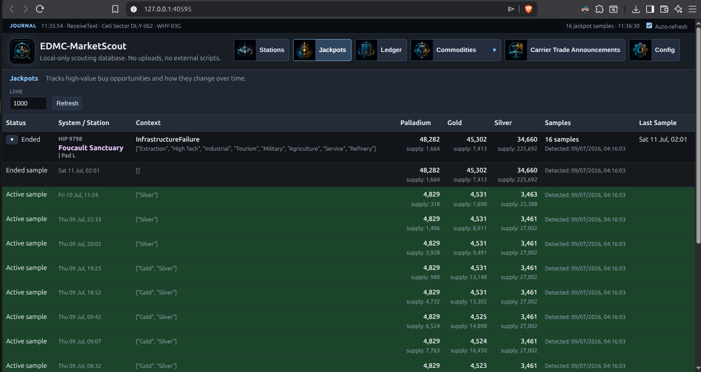

### Ledger

Shows recorded buy and sell activity from the Journal, including profit context and optional LIFO details.

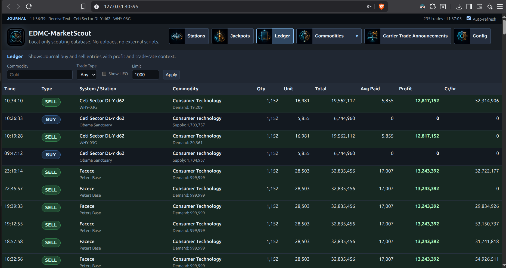

### Commodities

Lists imported commodity reference data, including category, min buy, average buy, max sell, and max profit.

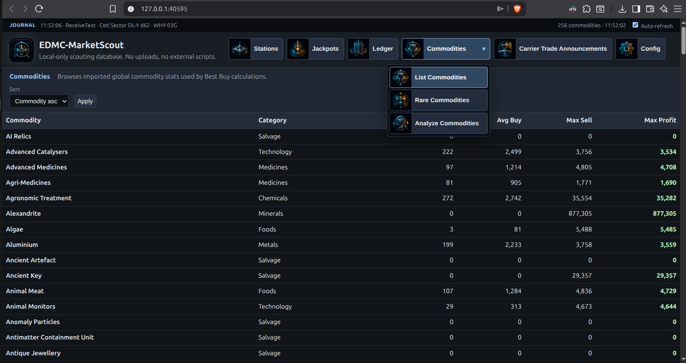

### Rare Commodities

Lists rare commodity sources, usual supply, buy prices, engineering unlock relevance, and distance information when coordinates are available.

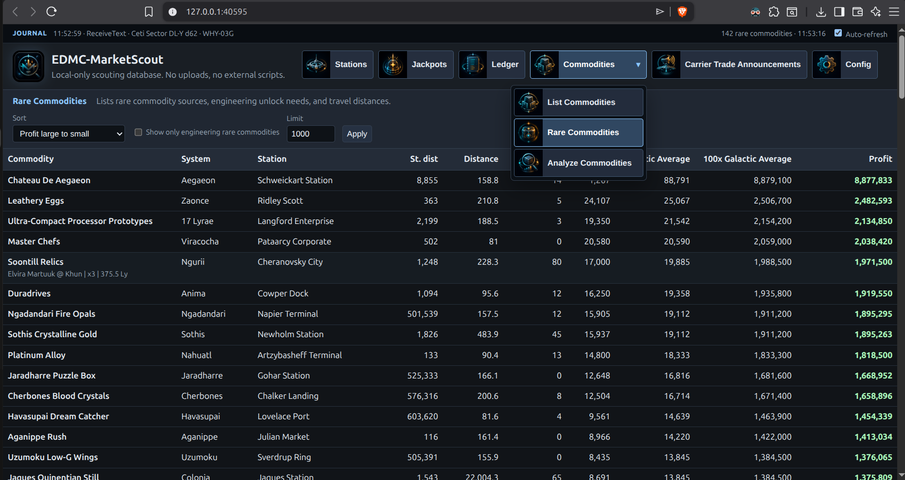

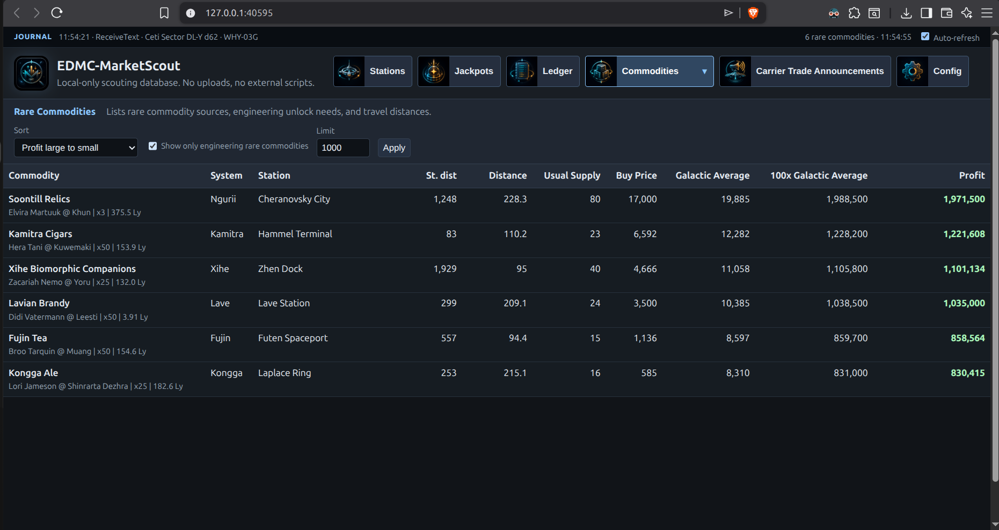

### Analyze Commodities

Paste a comma-separated commodity list and MarketScout splits detected entries into regular commodities and rare commodities.

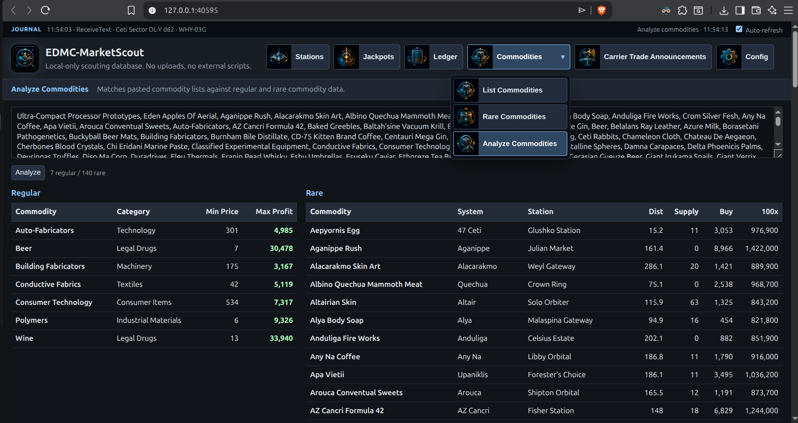

### Carrier Trade Announcements

Creates Fleet Carrier trade announcements with generated share text, custom announcement templates, draggable on-image text, and PNG/JPG poster downloads.

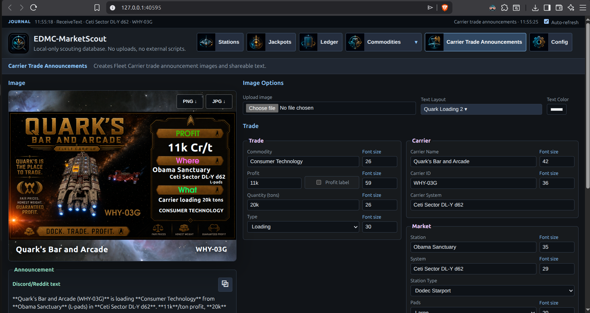

### Carrier Trade Calculator

Calculates Fleet Carrier buy/sell prices and profit splits for station-to-station trades, rare commodity carrier sales, and rare commodity station-to-station planning.

#### Station To Station

Calculates carrier buy and sell prices for a regular station-to-station trade, including carrier profit, loading hauler profit, and unloading hauler profit.

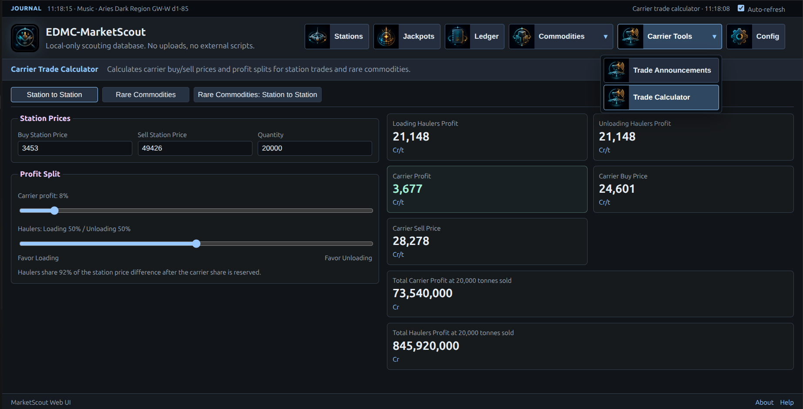

#### Rare Commodities

Calculates Fleet Carrier rare commodity sale pricing using the selected rare commodity, its origin buy price, and the maximum 100x galactic average carrier sale price.

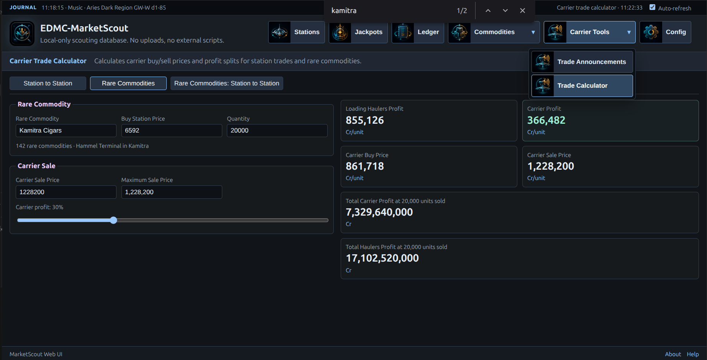

#### Rare Commodities: Station To Station

Compares rare commodity origin supply against a selected target station, intended mostly for Community Goal-style rare commodity hauling.

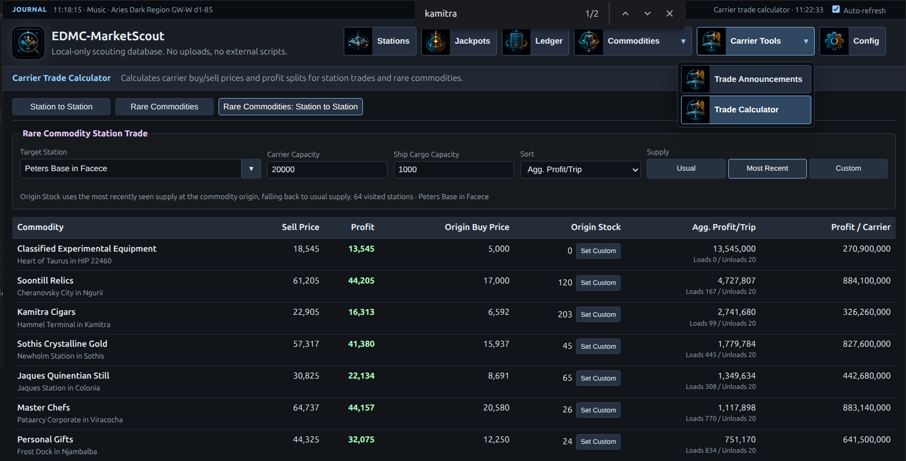

### Config

Controls the local web address, port, optional LAN access, and QR code sharing for opening MarketScout from another device on the same network.

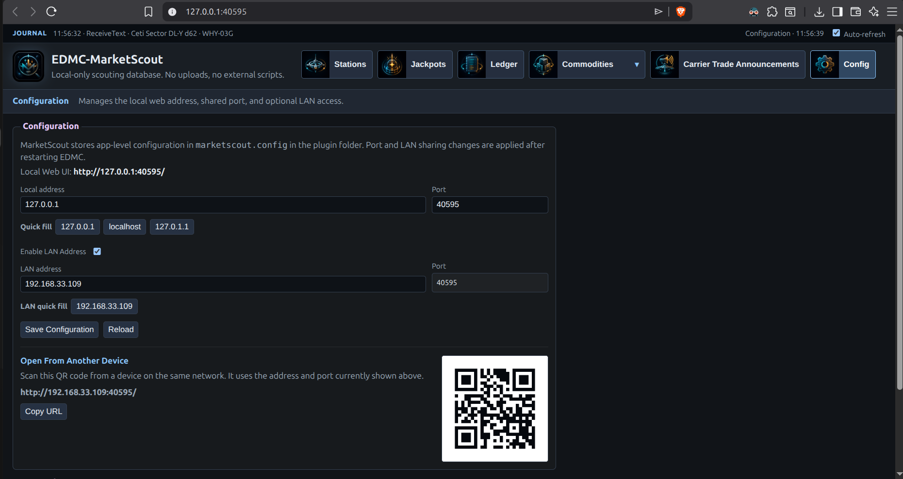

## Inspiration and Thanks

The projects below are not affiliated with MarketScout in any way, but they were very helpful and inspirational in the creation of MarketScout:

- [Elite:Dangerous Market Connector (EDMC)](https://github.com/EDCD/EDMarketConnector)
- [Conshmea's ACO Trade Helper](https://conshmea.com/acoTradeHelper)
- [Inara](https://inara.cz)
- [Spansh](https://spansh.co.uk)
- [EDDiscovery](https://github.com/EDDiscovery/EDDiscovery)
- [The very helpful people in the P.T.N.](https://pilotstradenetwork.com/)

## Technicalities

For a more technical README, see [EDMC-MarketScout/README.md](EDMC-MarketScout/README.md).
